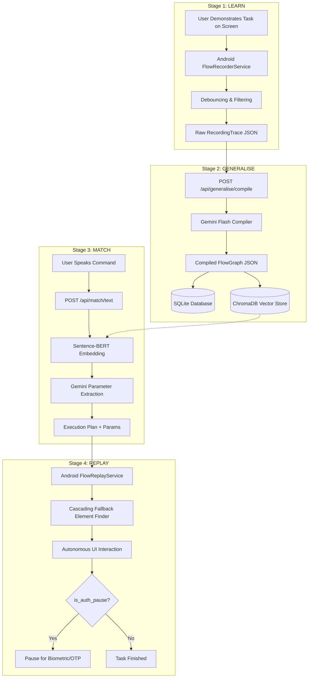
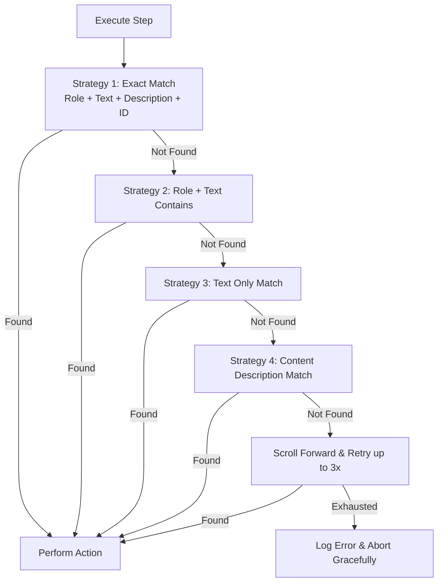

# FlowPilot - Technical Architecture & Pipeline Specification

> **Samsung PRISM Generative AI Hackathon - 3rd Edition (2026-27)**  
> **Theme #03: Teachable Voice Automation**  
> **Team Cheesecake - SRM Institute of Science and Technology**

---

## 1. High-Level Architecture

FlowPilot operates on a **4-stage decoupled pipeline**:

---

## 2. Stage Breakdown

### Stage 1: LEARN (Interaction Capture)
* **Service:** `FlowRecorderService` extending Android's `AccessibilityService`.
* **Captured Events:**
  * `TYPE_VIEW_CLICKED` -> Action type: `click`
  * `TYPE_VIEW_LONG_CLICKED` -> Action type: `long_press`
  * `TYPE_VIEW_TEXT_CHANGED` -> Action type: `type` (debounced by 500ms to capture final typed tokens)
  * `TYPE_VIEW_SCROLLED` -> Action type: `scroll`
* **Captured Metadata per Node:**
  * `package_name`: Target application ID
  * `element_class`: Widget type (e.g. `android.widget.EditText`, `Button`)
  * `element_text`: Visible label or text
  * `content_description`: Accessibility accessibility label
  * `element_id`: Resource ID (e.g., `com.zomato:id/search_query`)
  * `bounds`: On-screen rectangular coordinates `[left,top][right,bottom]`

### Stage 2: GENERALISE (AI Flow Synthesis)
* **Model:** Google Gemini Flash (`gemini-flash-latest` / `gemini-3.8-flash`) with structured JSON schema output.
* **Transformations Performed:**
  1. **Noise Reduction:** Drops redundant scrolls, accidental clicks, and system UI notifications.
  2. **Semantic Abstraction:** Converts coordinates into hierarchical semantic selectors:
     * Primary: `role` + `text_contains`
     * Secondary: `content_description_contains`
     * Tertiary: `resource_id_contains`
  3. **Parameter Slotting:** Detects user-typed entities (e.g., dish names, quantities, contact names) and declares parameter schemas with types and default values.
  4. **Synthetic Trigger Generation:** Generates 3-5 paraphrased voice invocations for vector indexing.
  5. **Safety Detection:** Automatically sets `is_auth_pause: true` for OTP, PIN, password, or final payment steps.

### Stage 3: MATCH (Vector Similarity Search)
* **Embedding Model:** `all-MiniLM-L6-v2` (384-dimensional embeddings via Sentence-BERT).
* **Storage:** Local ChromaDB collection (`flow_triggers`) using cosine distance metric.
* **Matching Threshold:** Maximum cosine distance of `0.45` (~55% cosine similarity) for robust matching while rejecting unrelated voice requests.

### Stage 4: REPLAY (Cascading Fallback Execution)
The `FlowReplayService` searches the live `AccessibilityNodeInfo` hierarchy using a 4-tier cascading fallback strategy:

---

## 3. Security & Privacy Guarantees

1. **Local Parameter Resolution:** Sensitive app flows execute on-device through Android's Accessibility framework.
2. **Zero Coordinate Hardcoding:** Dynamic screen resizing and responsive layouts do not break execution.
3. **Authentication Checkpoints (`is_auth_pause`):** FlowPilot never enters biometric authentication or UPI/Credit Card PINs automatically; execution halts and alerts the user to confirm transactions manually.
