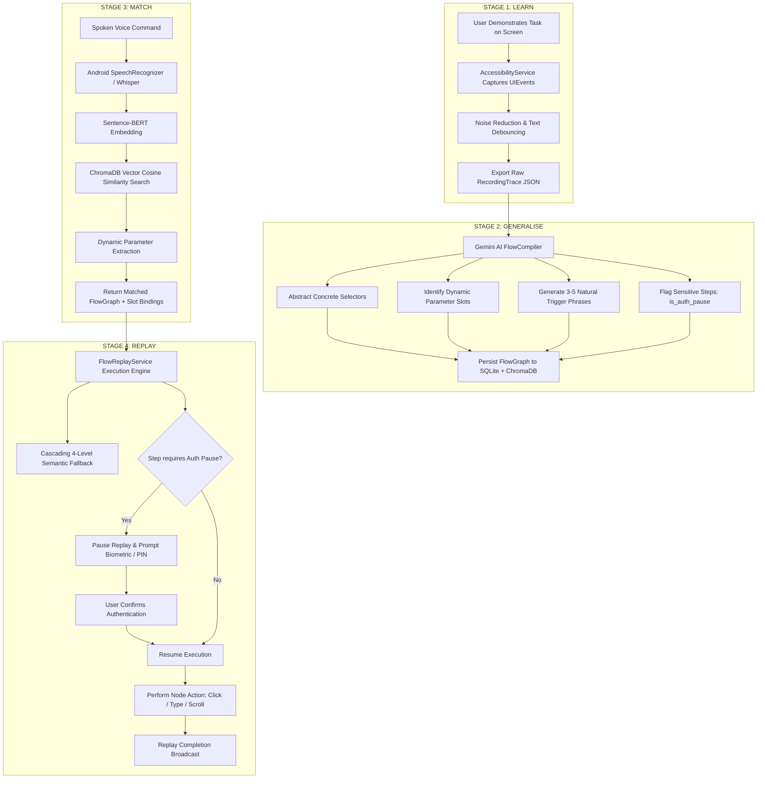
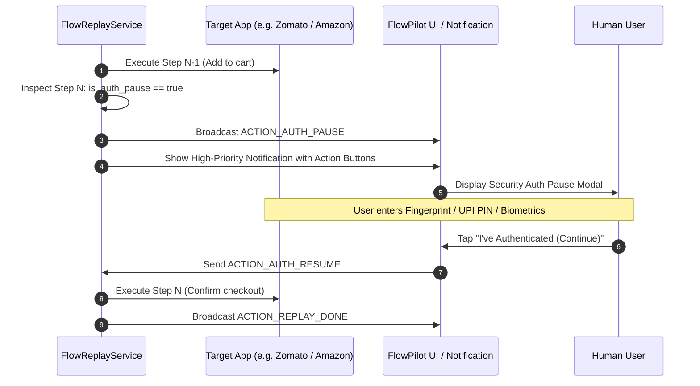

# FlowPilot Architecture & System Design

> **FlowPilot**: Learn-Once, Replay-Anywhere Teachable Voice Automation for Android  
> Built for Samsung PRISM Hackathon

---

## 1. System Overview

FlowPilot solves the fundamental limitation of traditional mobile voice assistants (like Bixby, Google Assistant, and Siri): **they only work with explicitly integrated first-party partner APIs**. FlowPilot enables users to teach the device *any* multi-step workflow in *any* Android application through a single natural demonstration. Once demonstrated, the workflow is automatically generalized, semantically indexed, and can be invoked anywhere via natural voice commands.

---

## 2. The 4-Stage Pipeline

### Stage 1: LEARN (Interaction Capture)
- **Component**: `FlowRecorderService` (`AccessibilityService`)
- **Captured Events**:
  - `TYPE_VIEW_CLICKED`: Clicks on buttons, lists, cards, tabs.
  - `TYPE_VIEW_TEXT_CHANGED`: Keystrokes and text inputs (debounced at 800ms).
  - `TYPE_VIEW_SCROLLED`: Vertical and horizontal page swipes.
  - `TYPE_WINDOW_STATE_CHANGED`: Activity and dialog transitions.
- **Node Attribute Extraction**: Captures `resource-id`, `className`, `text`, `contentDescription`, `bounds`, and `packageName`.
- **Filtering**: Filters system UI packages (`com.android.systemui`, `com.flowpilot`, keyboards) to prevent capturing noise.

### Stage 2: GENERALISE (Semantic Abstraction & Parameterisation)
- **Component**: `routers/generalise.py` + `services/gemini_service.py`
- **Compiler**: Google Gemini Flash models (`gemini-flash-lite-latest`, `gemini-3-flash-preview`, `gemini-3.7-flash`).
- **Transformations**:
  1. **Noise Removal**: Strips redundant intermediate clicks and transient focus changes.
  2. **Semantic Abstraction**: Transforms fragile coordinate/resource ID bindings into semantic selectors:
     - `role`: View type (`button`, `edittext`, `textview`, `imageview`)
     - `text_contains` / `text_equals`: Resilient text matching
     - `content_description_contains`: Accessibility labels
  3. **Parameter Slot Discovery**: Automatically detects typed items (e.g. "butter chicken", "lofi hip hop", "protein powder") and binds them to parameter definitions with runtime default values.
  4. **Trigger Phrase Generation**: Generates 3–5 diverse paraphrases and colloquial shortcuts for voice invocation.
  5. **Security Annotation**: Flags sensitive steps (`is_auth_pause = true`) involving checkout, payment, biometric login, or OTP entry.

### Stage 3: MATCH (Intent Matching & Slot Resolution)
- **Component**: `services/sbert_service.py` + `ChromaDB`
- **Model**: `all-MiniLM-L6-v2` (Sentence-BERT) embeddings with cosine distance metric.
- **Matching Criteria**:
  - Distance threshold: $\le 0.45$ (equivalent to $\ge 55\%$ cosine similarity).
  - Handles paraphrasing, synonyms, sentence structure inversions, and keyword queries.
  - Rejection of out-of-domain queries with zero false positives.
- **Dynamic Parameter Resolution**: Extracts named parameter values from free-form spoken input (e.g., extracting `quantity = 2` and `dish_name = "butter chicken"` from *"Order 2 butter chicken from Zomato"*).

### Stage 4: REPLAY (Fault-Tolerant Execution)
- **Component**: `FlowReplayService` (`AccessibilityService`)
- **Cascading 4-Level Fallback Matching**:
  1. **Level 1 (Exact Match)**: Matches all specified criteria (`role`, `text_contains`, `content_description`, `resource_id`).
  2. **Level 2 (Relaxed Text)**: Matches `role` and `text_contains`, ignoring volatile IDs.
  3. **Level 3 (Text Only)**: Matches visible text regardless of view hierarchy or container class.
  4. **Level 4 (Accessibility Label)**: Matches `content_description` for icon-only buttons.
- **Dynamic Parameter Injection**: Selectors replace default recorded terms with newly requested parameters at runtime.
- **Auto-Scroll Retry**: If an element is below the fold, automatically scrolls the active window forward and retries.

---

## 3. Security & Auth Pause Architecture

1. **Zero Credential Exposure**: FlowPilot never captures or replays passwords, PINs, or biometric secrets.
2. **Explicit User Gate**: When an `is_auth_pause` step is encountered, replay is safely suspended via a Kotlin `CompletableDeferred`.
3. **Timeout Protection**: Pauses time out after 60 seconds of inactivity to prevent unattended automation.

---

## 4. Hardware & Software Requirements

| Component | Technology | Version | Purpose |
| :--- | :--- | :--- | :--- |
| **Android OS** | Android SDK | API 26 – 35 (Android 8.0 - 15) | Mobile Client Platform |
| **UI Framework** | Jetpack Compose + Material3 | 2024.10.00 BOM | Reactive Modern UI |
| **Networking** | Retrofit + OkHttp3 + Gson | 2.11.0 | REST API Client with Snake-Case Serialization |
| **Automation** | Android AccessibilityService | API Level 35 | Non-Root OS Event Capture & Replay |
| **Backend** | Python / FastAPI | 3.11+ / 0.115+ | High-Throughput Async REST Backend |
| **Vector DB** | ChromaDB | 0.5+ | Local Vector Database for Semantic Search |
| **Embeddings** | Sentence-Transformers | `all-MiniLM-L6-v2` | Dense Trigger Phrase Vectorization |
| **AI LLM** | Google Gemini API | 3.8 / 3.7 / Flash-Lite | Multi-App Flow Synthesis & Compilation |
