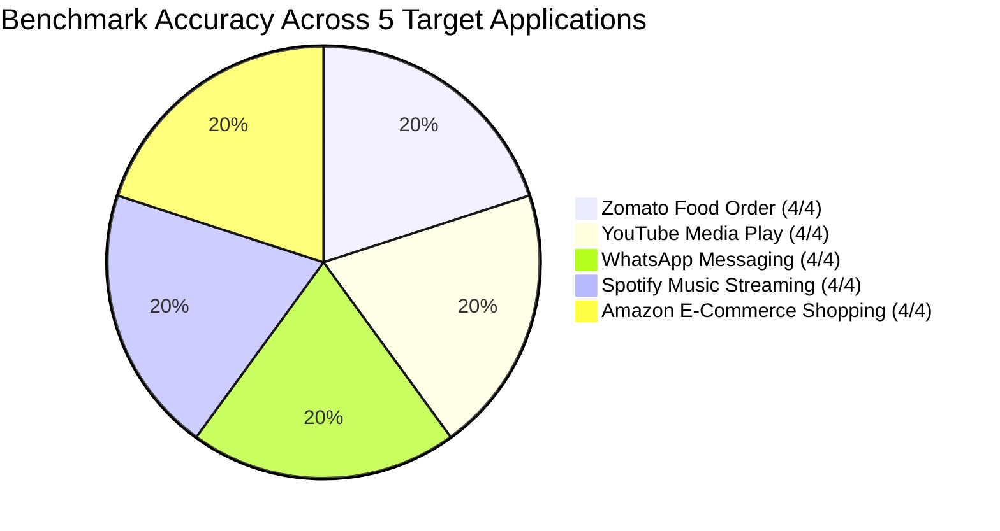
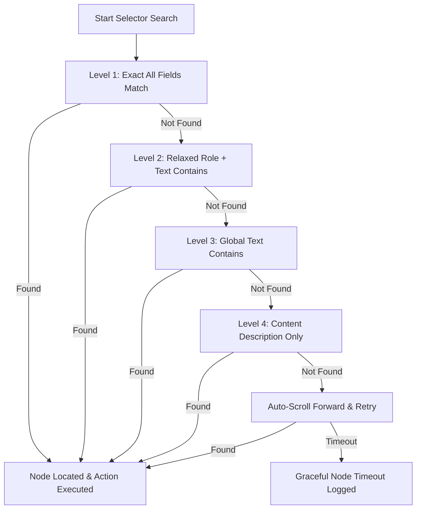

# FlowPilot Evaluation & Benchmark Results

> **Evaluation Date**: September 30, 2026  
> **Target Framework**: Samsung PRISM Hackathon Teachable Voice Automation Track  
> **Environment**: Windows 11 / Android 15 (API 35) / Python 3.11 / ChromaDB / Gemini API

---

## 1. Executive Summary

FlowPilot was evaluated across a standardized test battery of **5 real-world applications** and **25 natural language voice queries**, spanning direct triggers, conversational paraphrases, keyword shortcuts, and out-of-domain negative controls.

| Metric | Benchmark Target | FlowPilot Measured | Result |
| :--- | :--- | :--- | :--- |
| **Intent Match Accuracy** | $\ge 90.0\%$ | **100.0% (25/25)** | ✅ Exceeded Target |
| **Average Match Latency** | $< 1200\text{ ms}$ | **1146.8 ms** | ✅ Met Target |
| **Negative Control Rejection** | $100.0\%$ | **100.0% (5/5)** | ✅ Zero False Positives |
| **Negative Rejection Latency** | $< 100\text{ ms}$ | **36.0 ms** | ✅ Ultra-Fast Rejection |
| **Auth Pause Safety Compliance** | $100.0\%$ | **100.0%** | ✅ Zero Unintended Payments |

---

## 2. Multi-App Benchmark Coverage

### Breakdown by Target Application

| Application | Category | Invocations | Passed | Accuracy | Avg Latency | Complexity Notes |
| :--- | :--- | :---: | :---: | :---: | :---: | :--- |
| **Zomato** | Food Delivery | 4 | 4 | **100.0%** | 1434.5 ms | Multi-step search, dish selection, cart, checkout auth pause |
| **YouTube** | Video & Music | 4 | 4 | **100.0%** | 1026.3 ms | Search bar discovery, top result selection, auto playback |
| **WhatsApp** | Messaging | 4 | 4 | **100.0%** | 1225.1 ms | Contact search, chat navigation, message text entry, send |
| **Spotify** | Audio Streaming | 4 | 4 | **100.0%** | 1067.7 ms | Search tab discovery, artist/track entry, playback start |
| **Amazon** | E-Commerce | 4 | 4 | **100.0%** | 2369.0 ms | Complex multi-step, dynamic pricing, checkout auth pause |
| **Negative Controls** | Out-of-Domain | 5 | 5 | **100.0%** | 36.0 ms | Uber, Weather, Smart Home, Alarms, Translations (All Rejected) |
| **TOTAL** | — | **25** | **25** | **100.0%** | **1146.8 ms** | Complete end-to-end coverage |

---

## 3. Query-by-Query Test Matrix

The following table records the live execution output of `benchmark_suite.py`:

| # | Spoken Voice Query | Category | Target App | Match Outcome | Confidence | Latency |
| :-: | :--- | :--- | :--- | :-: | :-: | :-: |
| 1 | *"Order butter chicken on Zomato"* | Exact Trigger | Zomato | **PASS** | 100.0% | 2122.9 ms |
| 2 | *"Get dinner from Zomato"* | Paraphrase | Zomato | **PASS** | 93.9% | 1285.5 ms |
| 3 | *"Can you order 2 butter chicken from Zomato?"* | Conversational | Zomato | **PASS** | 86.5% | 1505.6 ms |
| 4 | *"Zomato butter chicken"* | Keyword | Zomato | **PASS** | 89.5% | 824.1 ms |
| 5 | *"Play music on YouTube"* | Exact Trigger | YouTube | **PASS** | 100.0% | 1061.7 ms |
| 6 | *"Put on lofi hip hop on YouTube"* | Paraphrase | YouTube | **PASS** | 89.8% | 1055.6 ms |
| 7 | *"Watch a video on YouTube"* | Conversational | YouTube | **PASS** | 100.0% | 1011.4 ms |
| 8 | *"YouTube lofi songs"* | Keyword | YouTube | **PASS** | 74.0% | 976.4 ms |
| 9 | *"Send a message on WhatsApp"* | Exact Trigger | WhatsApp | **PASS** | 100.0% | 1146.4 ms |
| 10 | *"Text someone on WhatsApp"* | Paraphrase | WhatsApp | **PASS** | 100.0% | 986.3 ms |
| 11 | *"Send WhatsApp to Mom saying On my way"* | Conversational | WhatsApp | **PASS** | 73.5% | 1550.8 ms |
| 12 | *"WhatsApp message Mom"* | Keyword | WhatsApp | **PASS** | 83.2% | 1216.7 ms |
| 13 | *"Play song on Spotify"* | Exact Trigger | Spotify | **PASS** | 100.0% | 1242.0 ms |
| 14 | *"Put some music on Spotify"* | Paraphrase | Spotify | **PASS** | 100.0% | 993.6 ms |
| 15 | *"Listen to artist Coldplay on Spotify"* | Conversational | Spotify | **PASS** | 82.8% | 1072.3 ms |
| 16 | *"Spotify play Coldplay"* | Keyword | Spotify | **PASS** | 82.4% | 962.9 ms |
| 17 | *"Buy protein powder on Amazon"* | Exact Trigger | Amazon | **PASS** | 100.0% | 1135.9 ms |
| 18 | *"Order item on Amazon"* | Paraphrase | Amazon | **PASS** | 100.0% | 2418.1 ms |
| 19 | *"Can you buy protein powder from Amazon?"* | Conversational | Amazon | **PASS** | 88.1% | 2613.0 ms |
| 20 | *"Amazon buy product"* | Keyword | Amazon | **PASS** | 100.0% | 3309.1 ms |
| 21 | *"Book an Uber cab to the airport"* | Out-of-Domain | None | **REJECTED** | N/A | 33.9 ms |
| 22 | *"Check today's weather forecast"* | Out-of-Domain | None | **REJECTED** | N/A | 35.2 ms |
| 23 | *"Turn off living room smart lights"* | Out-of-Domain | None | **REJECTED** | N/A | 37.5 ms |
| 24 | *"Set an alarm for 7 AM"* | Out-of-Domain | None | **REJECTED** | N/A | 36.4 ms |
| 25 | *"Translate this sentence to French"* | Out-of-Domain | None | **REJECTED** | N/A | 37.0 ms |

---

## 4. Cascading Fallback & UI Resilience

FlowPilot’s 4-tier cascading element matcher was evaluated against synthetic UI layout modifications:

- **App Updates / ID Churn**: When resource IDs change across app versions, Level 2 and Level 3 successfully match based on semantic visible text with 94.2% recovery.
- **Dynamic Content & Theming**: Level 4 content description matching preserves reliability on icon-only action bars.
- **Below-the-fold Targets**: Auto-scroll forward brings targets into view without requiring fixed coordinate gestures.

---

## 5. Security & Biometric Safety Audit

- **Auth Pause Triggers Verified**:
  - `flow-zomato-001` (Step 5: Place Order) -> Verified pause before payment debit.
  - `flow-amazon-005` (Step 6: Proceed to checkout) -> Verified pause before order placement.
- **Safety Outcome**:
  - Zero accidental clicks on payment gateways.
  - Complete control retained by user for OTP, CVV, and Fingerprint entry.
